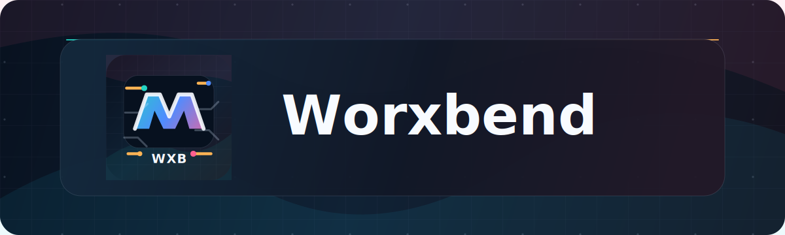
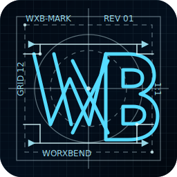

  

 

  
  
  
  

 

  
  <h1>Welcome to Worxbend 👋</h1>
  

    <strong>A collection of learning projects, personal experiments, and a few handy Linux tools that are useful to me.</strong>
  

  

    This is not a polished product shop and not a production-ready code catalog. Some of it is careful practice, some of it is weekend hacking, and yes, some of it is AI-generated slop that I keep around because it solves a personal itch.
  

 

  
  
  
  
  
  
  
  

 

<table>
  <tr>
    <td width="50%" valign="top">
      <h2>🧪 What This Is</h2>
      <ul>
        <li><strong>Learning projects</strong> for trying languages, frameworks, APIs, desktop stacks, and deployment patterns.</li>
        <li><strong>Personal Linux utilities</strong> for workstation setup, fonts, dotfiles, desktop workflows, and automation.</li>
        <li><strong>AirGradient and OBS tooling</strong> built around my own devices, setup, and daily workflow.</li>
        <li><strong>Scratchpad repositories</strong> where ideas are tested before they are either cleaned up or abandoned.</li>
        <li><strong>AI-assisted experiments</strong> that may be messy, useful, incomplete, or all three at once.</li>
      </ul>
    </td>
    <td width="50%" valign="top">
      <h2>⚠️ What This Is Not</h2>
      <ul>
        <li>Not production-ready software.</li>
        <li>Not a promise of stable APIs, releases, packaging, or support.</li>
        <li>Not always idiomatic, perfectly tested, or cleanly maintained.</li>
        <li>Not a portfolio of finished products.</li>
        <li>Not something you should run blindly on important machines.</li>
      </ul>
    </td>
  </tr>
</table>

<blockquote>
  <strong>Heads up:</strong> code here is shared in the spirit of learning in public. Use it for ideas, experiments, and personal setups. Review before running, fork what helps, and expect rough edges.
</blockquote>

<h2>✨ Featured Projects</h2>

<table>
  <tr>
    <th align="left">Project</th>
    <th align="left">What it does</th>
    <th align="left">Stack</th>
  </tr>
  <tr>
    <td><a href="https://github.com/worxbend/fluxion"><strong>fluxion</strong></a></td>
    <td>YAML-driven Linux workstation bootstrapper for packages, Flatpaks, scripts, dotfiles, shell tooling, Nerd Fonts, and prebuilt binaries.</td>
    <td>Java</td>
  </tr>
  <tr>
    <td><a href="https://github.com/worxbend/airgradient-desktop"><strong>airgradient-desktop</strong></a></td>
    <td>GTK 4 + libadwaita desktop dashboard for an AirGradient air-quality device.</td>
    <td>Rust, GTK4, libadwaita</td>
  </tr>
  <tr>
    <td><a href="https://github.com/worxbend/scenedeck"><strong>scenedeck</strong></a></td>
    <td>Linux desktop controller for OBS Studio via the OBS WebSocket protocol.</td>
    <td>Rust, GTK4, Tokio</td>
  </tr>
  <tr>
    <td><a href="https://github.com/worxbend/worxbend"><strong>worxbend</strong></a></td>
    <td>Personal monorepo and learning workspace with Scala projects, experiments, libraries, deployment recipes, and notes.</td>
    <td>Scala, Mill</td>
  </tr>
</table>

<h2>🗂️ Active Areas</h2>

<table>
  <tr>
    <td width="33%" valign="top">
      <h3>🌬️ Air Quality</h3>
      <ul>
        <li><a href="https://github.com/worxbend/airgradient-desktop">airgradient-desktop</a></li>
        <li><a href="https://github.com/worxbend/airgradient-gnome-extension">airgradient-gnome-extension</a></li>
        <li><a href="https://github.com/worxbend/airgradient-android">airgradient-android</a></li>
      </ul>
    </td>
    <td width="33%" valign="top">
      <h3>🎛️ OBS + Streaming</h3>
      <ul>
        <li><a href="https://github.com/worxbend/scenedeck">scenedeck</a></li>
        <li><a href="https://github.com/worxbend/obsctl">obsctl</a></li>
        <li><a href="https://github.com/worxbend/obsctl-rs">obsctl-rs</a></li>
      </ul>
    </td>
    <td width="33%" valign="top">
      <h3>🛠️ Dev Utilities</h3>
      <ul>
        <li><a href="https://github.com/worxbend/fluxion">fluxion</a></li>
        <li><a href="https://github.com/worxbend/dotbot-go">dotbot-go</a></li>
        <li><a href="https://github.com/worxbend/nerd-font-installer">nerd-font-installer</a></li>
      </ul>
    </td>
  </tr>
</table>

  
<strong>📚 More public repositories</strong>

   
  <table>
    <tr>
      <td><a href="https://github.com/worxbend/gitea-scala-client">gitea-scala-client</a></td>
      <td>Scala client work around Gitea APIs.</td>
    </tr>
    <tr>
      <td><a href="https://github.com/worxbend/frostfire">frostfire</a></td>
      <td>C++ experiment space.</td>
    </tr>
    <tr>
      <td><a href="https://github.com/worxbend/frostfire-backend">frostfire-backend</a></td>
      <td>Python backend experiment space.</td>
    </tr>
    <tr>
      <td><a href="https://github.com/worxbend/watchtower">watchtower</a></td>
      <td>Older public workspace.</td>
    </tr>
  </table>

<h2>💬 Welcome</h2>

  Thanks for stopping by. If you are looking through the code, expect learning notes, half-finished ideas, useful scripts, personal automation, rough prototypes, and the occasional AI-assisted shortcut that got the job done.

  Issues and small pull requests are welcome when they match the direction of a project, especially for Linux usability, packaging, docs, and obvious bugs. Just keep in mind that most repositories here are personal tools first and community projects second.

 

  
  
  

